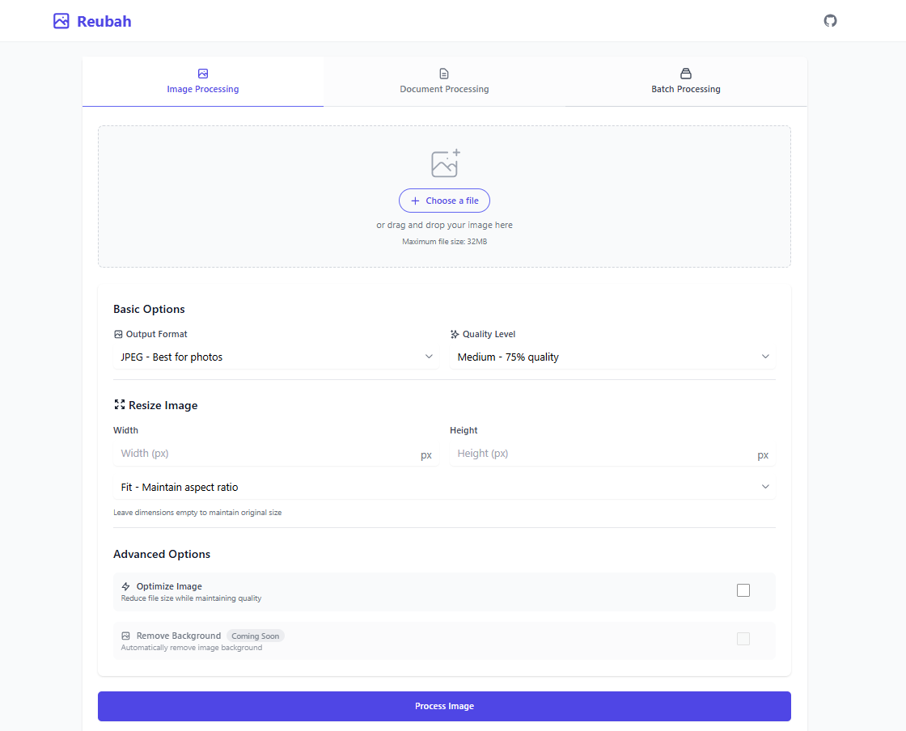
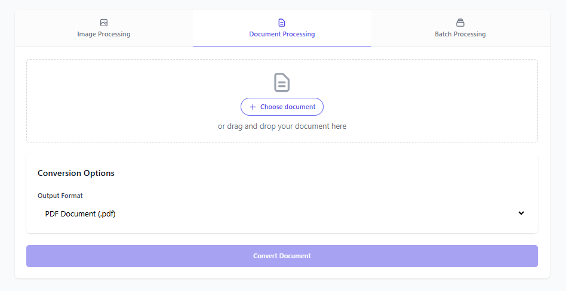
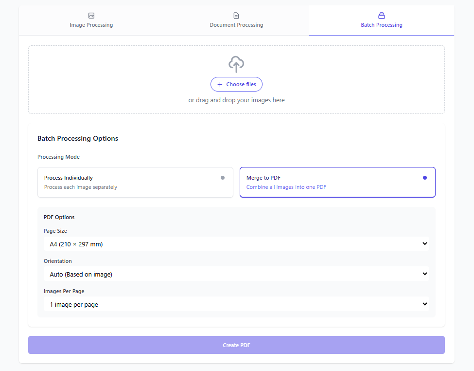

# Reubah - Universal File Converter & Image Processor

a simple web-based tool for processing images and converting documents with a simple interface

## Quick Start

### Using Docker
```bash
git clone https://github.com/dendianugerah/reubah.git
cd reubah
docker-compose up -d
```
or create a folder for the project and run
```bash
docker run -d --name app -p 8081:8081 -v $(pwd)/tmp:/app/tmp -v doc-temp:/tmp -e PORT=8081 --restart unless-stopped ghcr.io/dendianugerah/reubah:latest
```
Access at: `http://localhost:8081`

### Local Development
Requirements:
- Go 1.22+
- LibreOffice (for document conversion)
- GCC/G++

```bash
go mod download
go run cmd/server/main.go
```

## Images

Here are some images related to the project:





## Format Support & Compatibility

> **Matrix Guide:**
> - Find your source format in the left column
> - Follow the row to find available output formats
> - ✅ = Supported conversion
> - `-` = Same format (no conversion needed)

### Image Conversion Matrix

| From ➡️ To ⬇️ | JPG | PNG | WebP | GIF | BMP | PDF |
|--------------|:---:|:---:|:----:|:---:|:---:|:---:|
| **JPG**      | -   | ✅  | ✅   | ✅  | ✅  | ✅  |
| **PNG**      | ✅  | -   | ✅   | ✅  | ✅  | ✅  |
| **WebP**     | ✅  | ✅  | -    | ✅  | ✅  | ✅  |
| **GIF**      | ✅  | ✅  | ✅   | -   | ✅  | ✅  |
| **BMP**      | ✅  | ✅  | ✅   | ✅  | -   | ✅  |

### Document Conversion Matrix

| From ➡️ To ⬇️ | PDF | DOCX | DOC | ODT | RTF | TXT |
|--------------|:---:|:----:|:---:|:---:|:---:|:---:|
| **PDF** (Soon)     | -   | ❌   | ❌  | ❌  | ❌  | ❌  |
| **DOCX**     | ✅  | -    | ✅  | ✅  | ✅  | ✅  |
| **DOC**      | ✅  | ✅   | -   | ✅  | ✅  | ✅  |
| **ODT**      | ✅  | ✅   | ✅  | -   | ✅  | ✅  |
| **RTF**      | ✅  | ✅   | ✅  | ✅  | -   | ✅  |
| **TXT**      | ✅  | ✅   | ✅  | ✅  | ✅  | -   |

### Additional Image Features

| Format | Background Removal (Soon) | Optimization | Batch Processing |
|--------|:-----------------:|:------------:|:---------------:|
| JPG    | ❌                | ✅           | ✅              |
| PNG    | ❌                | ❌           | ✅              |
| WebP   | ❌                | ❌           | ✅              |
| GIF    | ❌                | ❌           | ✅              |
| BMP    | ❌                | ❌           | ✅              |

## Notes

- Isolated processing environment
- No file storage - immediate delivery
- Automatic cleanup
- Input validation